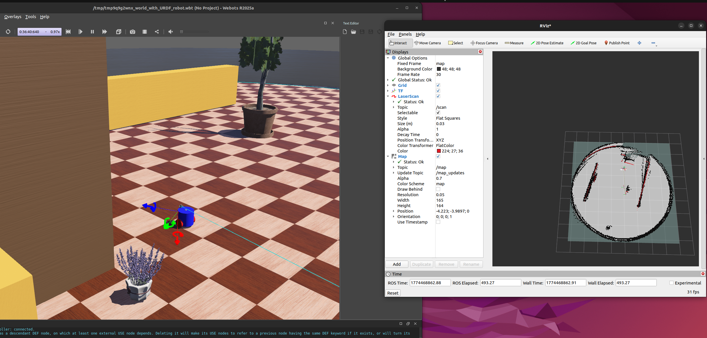

# third_webots_pkg
This is an example webots diffdrive robot that has Lidar and IMU capability. 

The wheels don't have hall sensors on purpose, this is for me to test SLAM with
dead reckoning and some sensors, as well as other robot configurations. I will
probably add the hall sensors back someday. With this robot body I have a good
deal of control over how to map which is nice.

I call it the third because the other two packages sucked :P.

## Quickstart
Build normally with `colcon build` and `source install/local_setup.bash`.

Then launch the whole sim minus mapping with
`ros2 launch third_webots_pkg robot_launch.py`

In another terminal you can run mapping with 
`ros2 launch third_webots_pkg mapping_launch.py`




## Files
### `worlds/my_world.wbt`

Taken from building a world and robot file from an empty webots world and going
from there.

Currently the robot in this world has its URDF counterpart living in
`resource/robot_model.urdf`. Update it by running the world file in webots,
right click `Robot "my_robot"` in the scene tree on the left and select "Export
URDF". Save the new file and go into `launch/robot_launch.py` and update
`robot_model_path` with the correct path name along with updating `setup.py`.

See the lidar visuals by setting View > optional rendering > show lidar rays
there are by default 4 lidar ray layers, for 2D lidar we only need 1 so make
sure to set that.

### `resource/third_webots_robot.urdf`

This file hooks up the sensors (lidar and imu so far) to ros2 via the
webots_ros2_driver plugins

```xml
<webots>
    <device reference="top lidar" type="Lidar">
        <ros>
            <frameName>top lidar</frameName> <!-- Ensure matches whats in robot_model.urdf -->
            <enabled>true</enabled>
            <scanRate>10</scanRate>
            <topicName>~/scan</topicName>
            <alwaysOn>true</alwaysOn>
        </ros>
    </device>

    <plugin type="webots_ros2_driver::Ros2IMU">
      <enabled>true</enabled>
      <updateRate>20</updateRate>
      <topicName>/imu</topicName>
      <alwaysOn>true</alwaysOn>
      <frameName>imu_link</frameName>
      <inertialUnitName>imu</inertialUnitName> <!-- Ensure this matches whats in robot_model.urdf -->
      <gyroName>gyro</gyroName>
      <accelerometerName>accelerometer</accelerometerName>
    </plugin>

    <plugin type="webots_ros2_control::Ros2Control" />
</webots>
```

This file also contains the necessary plugin information to integrate ros2
diffdrive controls directly with webots motors.

Many of the Hardware Interfaces necessary can be listed with this command after
running `robot_launch.py`

`ros2 service call /controller_manager/list_hardware_interfaces controller_manager_msgs/srv/ListHardwareInterfaces {}`

```xml
<ros2_control name="WebotsControl" type="system">
    <hardware>
        <plugin>webots_ros2_control::Ros2ControlSystem</plugin>
    </hardware>
    <joint name="right wheel motor">
        <state_interface name="position" /> <!-- still needed despite not having hall sensor-->
        <state_interface name="velocity"/>
        <command_interface name="velocity" />
    </joint>
    <joint name="left wheel motor">
        <state_interface name="position" />
        <state_interface name="velocity"/>
        <command_interface name="velocity" />
    </joint>
</ros2_control>
```

Notice that we also add the position interface despite not using hall sensors. 
This is necessary for diffdrive_controller to work, but we can still use dead 
reckoning by adjusting some settings below.

### `ros2control.yml`
(Don't forget to add these in setup.py and launch.py!)

```yml
controller_manager:
  ros__parameters:
    update_rate: 50 # from webots WorldInfo basicTimeStep=20ms, 1/ts = 50hz

    diffdrive_controller:
      type: diff_drive_controller/DiffDriveController

    joint_state_broadcaster:
      type: joint_state_broadcaster/JointStateBroadcaster

diffdrive_controller:
  ros__parameters:
    left_wheel_names: ["left wheel motor"]
    right_wheel_names: ["right wheel motor"]

    wheel_separation: 0.09
    wheel_radius: 0.025

    # The real separation between wheels is not resulting in a perfect odometry
    # wheel_separation_multiplier: 1.112

    use_stamped_vel: false     # subscribe to cmd_vel that uses twist_vel (newer ros2 versions)
    base_frame_id: "base_link" # frame of robot base
    odom_frame_id: "odom"      # frame of odometry base
    enable_odom_tf: true       # publish to odom->base link for rviz
    open_loop: true            # integrate wheel vels, like the one below kinda
    use_feedback: true         # integrate wheel vels, dont use the position feedback. key for getting dead reckoning
    
    linear:
      x:
        max_velocity: 0.15 # Maximal speed of robot

joint_state_broadcaster:
  ros__parameters:
    base_frame_id: base_link
```

The important parts are in diffdrive_controller for getting the names of what
diffdrive will be controlling, wheel separation and radius, open_loop and
use_feedback to ensure diffdrive doesn't use the position sensor that isn't
actually publishing anything. We will use dead reckoning. Turn these to false if
you are going to use hall sensors.

